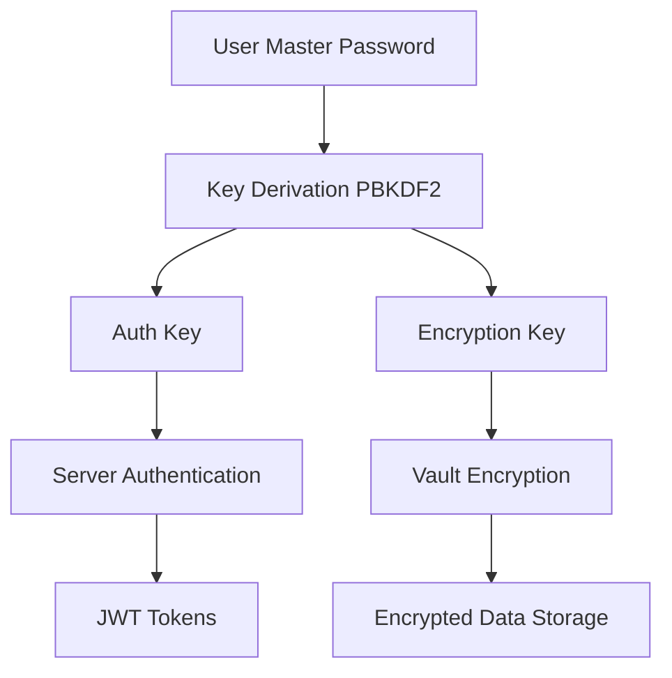

SecureVault is a secure password management application that provides users with a safe, encrypted vault to store, organize, and manage their passwords and sensitive credentials. Built on Next.js 16, it emphasizes zero-knowledge architecture, end-to-end encryption, and an intuitive user interface.

## Key Features

<CardGroup cols={2}>
  <Card title="Zero-Knowledge Architecture" icon="shield-halved">
    The server never has access to unencrypted user data. All encryption happens client-side.
  </Card>
  <Card title="AES-256-GCM Encryption" icon="lock">
    Military-grade encryption using Web Crypto API with authenticated encryption.
  </Card>
  <Card title="Password Generator" icon="wand-magic-sparkles">
    Generate cryptographically secure passwords and memorable passphrases.
  </Card>
  <Card title="Password Strength Analysis" icon="gauge-high">
    Real-time analysis with entropy calculation and security recommendations.
  </Card>
  <Card title="Organization Tools" icon="folder-tree">
    Categories, tags, favorites, and powerful search capabilities.
  </Card>
  <Card title="Security Dashboard" icon="chart-line">
    Track weak, reused, and compromised passwords across your vault.
  </Card>
</CardGroup>

## Architecture

SecureVault follows a zero-knowledge architecture where sensitive data is encrypted on the client before transmission:



### Client-Side Security

- **PBKDF2 Key Derivation**: 600,000 iterations (OWASP 2023 recommendation)
- **Separate Keys**: Authentication and encryption keys derived independently
- **AES-256-GCM**: Authenticated encryption with 96-bit IV
- **No Plain Text**: Passwords never leave the client in unencrypted form

### Server-Side Security

- **Bcrypt Hashing**: Additional server-side hashing of authentication hash
- **JWT Tokens**: Secure session management with rotation
- **MongoDB Storage**: Encrypted vault data stored securely
- **Security Headers**: HSTS, CSP, and other protection mechanisms

## Technology Stack

<CardGroup cols={3}>
  <Card title="Next.js 16" icon="react">
    App Router with React Server Components
  </Card>
  <Card title="TypeScript" icon="code">
    Type-safe development with Zod validation
  </Card>
  <Card title="MongoDB" icon="database">
    Secure document storage with Mongoose ODM
  </Card>
  <Card title="Zustand" icon="atom">
    Lightweight state management for vault data
  </Card>
  <Card title="TanStack Query" icon="arrows-rotate">
    Data fetching and caching layer
  </Card>
  <Card title="Tailwind CSS" icon="paintbrush">
    Modern, responsive UI design system
  </Card>
</CardGroup>

## Core Principles

### Zero-Knowledge Design

The server never receives or stores:
- Master password in any form
- Unencrypted vault data
- Encryption keys

<Note>
**What the Server Stores**: Only the authentication hash (bcrypt), encrypted vault data, and encrypted vault key. The encryption key itself is encrypted with the user's derived encryption key.
</Note>

### End-to-End Encryption

All sensitive data is encrypted client-side before transmission:

```typescript
// Client-side encryption example
import { encrypt, deriveKeys } from '@/lib/crypto/client';

// Derive keys from master password
const { encryptionKey, authHash } = await deriveKeys(
  masterPassword,
  salt
);

// Encrypt password entry
const encryptedData = await encrypt(
  JSON.stringify(passwordEntry),
  encryptionKey
);

// Send encrypted data to server
await api.createPassword({ encryptedData, iv });
```

### User Privacy

Minimal data collection with maximum user control:
- Only email required for account identification
- Optional profile information
- No telemetry or tracking
- User-controlled data export and deletion

## Quick Start

<Steps>
  <Step title="Install Dependencies">
    ```bash
    cd apps/secure
    npm install
    ```
  </Step>
  <Step title="Configure Environment">
    Create `.env.local` with required variables:
    ```bash
    MONGODB_URI=mongodb://localhost:27017/securevault
    JWT_SECRET=your-secret-key
    JWT_REFRESH_SECRET=your-refresh-secret
    ```
  </Step>
  <Step title="Run Development Server">
    ```bash
    npm run dev
    ```
    
    Open [http://localhost:3000](http://localhost:3000) to access SecureVault.
  </Step>
</Steps>

## Security Considerations

<Warning>
**Master Password**: The master password is the key to everything. If lost, there is no recovery option due to the zero-knowledge architecture. Users should save their recovery key during registration.
</Warning>

<AccordionGroup>
  <Accordion title="Why zero-knowledge?">
    Zero-knowledge architecture ensures that even if the server is compromised, user data remains secure because the server never has access to unencrypted data or encryption keys.
  </Accordion>
  <Accordion title="What if I forget my master password?">
    Users can generate a recovery key during registration. This key must be stored securely offline. Without the master password or recovery key, data cannot be decrypted.
  </Accordion>
  <Accordion title="How are passwords analyzed for strength?">
    Password strength is calculated client-side using entropy analysis, pattern detection, and character variety checks. No passwords are sent to external services.
  </Accordion>
</AccordionGroup>

## Next Steps

<CardGroup cols={2}>
  <Card title="Features" icon="sparkles" href="/applications/securevault/features">
    Explore all features including password generation and organization
  </Card>
  <Card title="Password Management" icon="key" href="/applications/securevault/password-management">
    Learn how to manage passwords effectively
  </Card>
  <Card title="Security Details" icon="shield" href="/applications/securevault/security">
    Deep dive into encryption and security architecture
  </Card>
  <Card title="Categories & Tags" icon="tags" href="/applications/securevault/categories-tags">
    Organize your vault with categories and tags
  </Card>
</CardGroup>