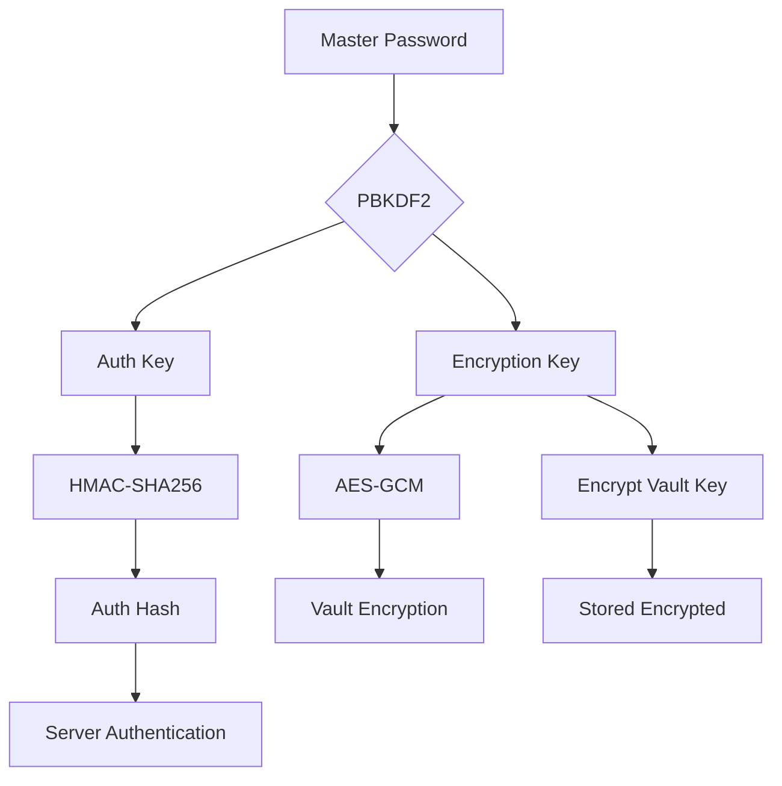
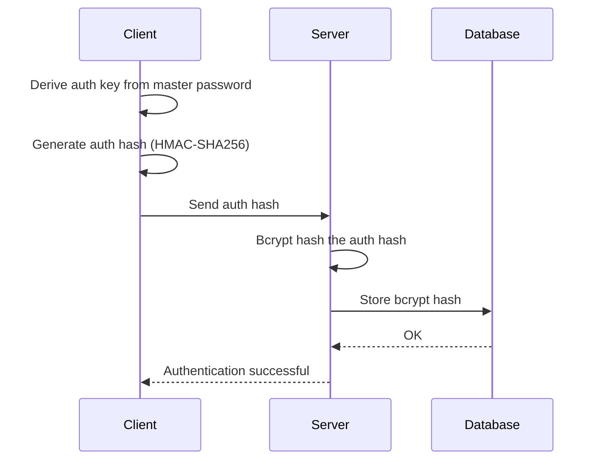

SecureVault implements a zero-knowledge architecture with client-side encryption using industry-standard cryptographic algorithms.

## Encryption Overview

All sensitive data is encrypted using AES-256-GCM before leaving the client.

### AES-256-GCM

<CardGroup cols={2}>
  <Card title="Algorithm" icon="lock">
    AES-256-GCM (Galois/Counter Mode)
  </Card>
  <Card title="Key Length" icon="key">
    256 bits (32 bytes)
  </Card>
  <Card title="IV Length" icon="shuffle">
    96 bits (12 bytes)
  </Card>
  <Card title="Auth Tag" icon="shield-check">
    128 bits (16 bytes)
  </Card>
</CardGroup>

### Why AES-256-GCM?

<AccordionGroup>
  <Accordion title="Authenticated Encryption">
    GCM mode provides both confidentiality and authenticity. It prevents tampering by including an authentication tag that verifies data integrity.
  </Accordion>
  <Accordion title="Performance">
    GCM mode is highly efficient and can be parallelized, making it fast even for large amounts of data.
  </Accordion>
  <Accordion title="Industry Standard">
    AES-256-GCM is recommended by NIST and used by major security applications including 1Password and Bitwarden.
  </Accordion>
  <Accordion title="Browser Support">
    Native support in Web Crypto API without external dependencies.
  </Accordion>
</AccordionGroup>

## Key Derivation

SecureVault uses PBKDF2 to derive cryptographic keys from the user's master password.

### PBKDF2 Configuration

```typescript /home/daytona/workspace/source/apps/secure/src/lib/crypto/client.ts
const PBKDF2_ITERATIONS = 600000; // OWASP 2023 recommendation
const KEY_LENGTH = 256; // bits
const HASH_ALGORITHM = 'SHA-256';
```

### Dual Key Derivation

Two separate keys are derived for different purposes:

<Steps>
  <Step title="Generate Salts">
    Create separate salts for authentication and encryption:
    
    ```typescript
    const encoder = new TextEncoder();
    
    // Authentication salt
    const authSalt = await crypto.subtle.digest(
      'SHA-256',
      encoder.encode(salt + ':auth')
    );
    
    // Encryption salt  
    const encSalt = await crypto.subtle.digest(
      'SHA-256',
      encoder.encode(salt + ':enc')
    );
    ```
  </Step>
  
  <Step title="Derive Authentication Key">
    Used for server authentication:
    
    ```typescript
    const authKey = await crypto.subtle.deriveKey(
      {
        name: 'PBKDF2',
        salt: new Uint8Array(authSalt),
        iterations: PBKDF2_ITERATIONS,
        hash: 'SHA-256'
      },
      keyMaterial,
      { name: 'HMAC', hash: 'SHA-256', length: KEY_LENGTH },
      true,
      ['sign']
    );
    ```
  </Step>
  
  <Step title="Derive Encryption Key">
    Used for vault encryption:
    
    ```typescript
    const encryptionKey = await crypto.subtle.deriveKey(
      {
        name: 'PBKDF2',
        salt: new Uint8Array(encSalt),
        iterations: PBKDF2_ITERATIONS,
        hash: 'SHA-256'
      },
      keyMaterial,
      { name: 'AES-GCM', length: KEY_LENGTH },
      true,
      ['encrypt', 'decrypt']
    );
    ```
  </Step>
  
  <Step title="Generate Auth Hash">
    Create hash to send to server:
    
    ```typescript
    const authHashBuffer = await crypto.subtle.sign(
      'HMAC',
      authKey,
      saltBuffer
    );
    const authHash = arrayBufferToHex(authHashBuffer);
    ```
  </Step>
</Steps>

### Key Hierarchy



## Encryption Process

### Encrypting Data

<CodeGroup>
```typescript Client Implementation
import { encrypt } from '@/lib/crypto/client';

export async function encrypt(
  plaintext: string,
  key: CryptoKey
): Promise<EncryptedData> {
  const encoder = new TextEncoder();
  const data = encoder.encode(plaintext);
  
  // Generate random IV (12 bytes for GCM)
  const iv = crypto.getRandomValues(new Uint8Array(12));
  
  // Encrypt with AES-256-GCM
  const ciphertext = await crypto.subtle.encrypt(
    {
      name: 'AES-GCM',
      iv
    },
    key,
    data
  );
  
  return {
    ciphertext: arrayBufferToBase64(ciphertext),
    iv: arrayBufferToBase64(iv.buffer),
    version: 1
  };
}
```

```typescript Encrypt Object
export async function encryptObject<T>(
  obj: T,
  key: CryptoKey
): Promise<EncryptedData> {
  const json = JSON.stringify(obj);
  return encrypt(json, key);
}

// Example usage
const passwordData = {
  name: 'Gmail',
  username: 'user@example.com',
  password: 'SecurePassword123!',
  urls: ['https://gmail.com'],
  notes: 'Personal email'
};

const encrypted = await encryptObject(
  passwordData,
  vaultEncryptionKey
);
```
</CodeGroup>

### Decrypting Data

<CodeGroup>
```typescript Decrypt Function
export async function decrypt(
  encryptedData: EncryptedData,
  key: CryptoKey
): Promise<string> {
  const ciphertext = base64ToArrayBuffer(encryptedData.ciphertext);
  const iv = base64ToArrayBuffer(encryptedData.iv);
  
  // Decrypt with AES-256-GCM
  const decrypted = await crypto.subtle.decrypt(
    {
      name: 'AES-GCM',
      iv: new Uint8Array(iv)
    },
    key,
    ciphertext
  );
  
  const decoder = new TextDecoder();
  return decoder.decode(decrypted);
}
```

```typescript Decrypt Object
export async function decryptObject<T>(
  encryptedData: EncryptedData,
  key: CryptoKey
): Promise<T> {
  const json = await decrypt(encryptedData, key);
  return JSON.parse(json) as T;
}

// Example usage
const passwordData = await decryptObject<PasswordData>(
  encrypted,
  vaultEncryptionKey
);
```
</CodeGroup>

## Server-Side Security

While the client performs encryption, the server adds additional security layers.

### Auth Hash Verification

The server uses bcrypt to hash the authentication hash received from the client:

```typescript /home/daytona/workspace/source/apps/secure/src/lib/crypto/server.ts
import { hash, compare } from 'bcryptjs';

const SALT_ROUNDS = 12;

/**
 * Hash the auth hash with bcrypt
 * Adds server-side security layer
 */
export async function hashAuthHash(authHash: string): Promise<string> {
  return hash(authHash, SALT_ROUNDS);
}

/**
 * Verify client's auth hash
 */
export async function verifyAuthHash(
  authHash: string,
  storedHash: string
): Promise<boolean> {
  return compare(authHash, storedHash);
}
```

### Double Hashing

Why hash the hash?

<Accordion title="Defense in Depth">
  Even if the database is compromised, attackers cannot authenticate without the original master password. The bcrypt hash adds computational difficulty.
</Accordion>



### JWT Token Security

<CodeGroup>
```typescript Generate Access Token
import { SignJWT } from 'jose';

const ACCESS_TOKEN_EXPIRY = '15m';

export async function generateAccessToken(
  userId: string,
  email: string
): Promise<string> {
  return new SignJWT({
    sub: userId,
    email,
    type: 'access'
  })
    .setProtectedHeader({ alg: 'HS256' })
    .setIssuedAt()
    .setExpirationTime(ACCESS_TOKEN_EXPIRY)
    .sign(getJwtSecretKey());
}
```

```typescript Generate Refresh Token
const REFRESH_TOKEN_EXPIRY = '7d';

export async function generateRefreshToken(
  userId: string,
  email: string
): Promise<string> {
  return new SignJWT({
    sub: userId,
    email,
    type: 'refresh'
  })
    .setProtectedHeader({ alg: 'HS256' })
    .setIssuedAt()
    .setExpirationTime(REFRESH_TOKEN_EXPIRY)
    .sign(getRefreshSecretKey());
}
```

```typescript Verify Token
export async function verifyAccessToken(
  token: string
): Promise<JWTPayload | null> {
  try {
    const { payload } = await jwtVerify(token, getJwtSecretKey());
    
    if (payload.type !== 'access') {
      return null;
    }
    
    return payload as unknown as JWTPayload;
  } catch {
    return null;
  }
}
```
</CodeGroup>

## Data Storage

What gets stored and where:

### Client Storage (Browser)

<Tabs>
  <Tab title="sessionStorage">
    **Encryption Key** (temporary)
    
    - Stored only while vault is unlocked
    - Cleared on browser close
    - Never persisted to disk
    
    ```typescript
    // Store encryption key in session
    const keyString = await crypto.subtle.exportKey('raw', encryptionKey);
    sessionStorage.setItem('vaultKey', arrayBufferToBase64(keyString));
    
    // Retrieve encryption key
    const storedKey = sessionStorage.getItem('vaultKey');
    const keyBuffer = base64ToArrayBuffer(storedKey);
    const encryptionKey = await crypto.subtle.importKey(
      'raw',
      keyBuffer,
      { name: 'AES-GCM', length: 256 },
      true,
      ['encrypt', 'decrypt']
    );
    ```
  </Tab>
  
  <Tab title="localStorage">
    **User Preferences** (non-sensitive)
    
    - Theme settings
    - View mode (grid/list)
    - UI preferences
    
    ```typescript
    localStorage.setItem('theme', 'dark');
    localStorage.setItem('viewMode', 'grid');
    ```
  </Tab>
  
  <Tab title="Memory Only">
    **Decrypted Passwords**
    
    - Kept in React state
    - Never written to storage
    - Cleared on logout
    
    ```typescript
    const [passwords, setPasswords] = useState<DecryptedPasswordEntry[]>([]);
    ```
  </Tab>
</Tabs>

### Server Storage (MongoDB)

```typescript
// What the server stores (from apps/secure/src/lib/db/models.ts)
const passwordSchema = new Schema({
  userId: { type: Schema.Types.ObjectId, required: true },
  
  // Encrypted blob - server cannot decrypt
  encryptedData: { type: String, required: true },
  iv: { type: String, required: true },
  
  // Metadata - not encrypted
  categoryId: Schema.Types.ObjectId,
  tags: [String],
  favorite: Boolean,
  
  // Security analysis
  passwordStrength: { type: Number, min: 0, max: 4 },
  isCompromised: Boolean,
  isReused: Boolean,
  
  // Timestamps
  createdAt: Date,
  updatedAt: Date,
  lastUsedAt: Date,
  passwordChangedAt: Date,
  deletedAt: Date,
  
  encryptionVersion: { type: Number, default: 1 }
});
```

## Security Best Practices

### Input Validation

All API inputs are validated using Zod schemas:

```typescript /home/daytona/workspace/source/apps/secure/src/lib/validations.ts
import { z } from 'zod';

export const createPasswordSchema = z.object({
  encryptedData: z.string().min(1, 'Encrypted data required'),
  iv: z.string().min(1, 'IV required'),
  metadata: z.object({
    categoryId: z.string().optional(),
    tags: z.array(z.string().max(50)).max(20),
    favorite: z.boolean(),
    passwordStrength: z.union([
      z.literal(0),
      z.literal(1),
      z.literal(2),
      z.literal(3),
      z.literal(4)
    ]),
    isCompromised: z.boolean(),
    isReused: z.boolean()
  })
});
```

### HTTPS Only

All communication uses TLS 1.3:

```typescript
const securityHeaders = {
  'Strict-Transport-Security': 'max-age=31536000; includeSubDomains; preload',
  'Content-Security-Policy': "default-src 'self';",
  'X-Content-Type-Options': 'nosniff',
  'X-Frame-Options': 'DENY',
  'X-XSS-Protection': '1; mode=block'
};
```

### Session Management

- **Short-lived access tokens**: 15 minutes
- **Longer refresh tokens**: 7 days
- **Auto-lock on inactivity**: Configurable (1-60 minutes)
- **Token rotation**: New tokens on refresh

## Threat Model

### What SecureVault Protects Against

<CardGroup cols={2}>
  <Card title="Server Breach" icon="server">
    Even if the server is compromised, vault data remains encrypted
  </Card>
  <Card title="Network Sniffing" icon="wifi">
    HTTPS encryption protects data in transit
  </Card>
  <Card title="Database Theft" icon="database">
    Stolen database contains only encrypted data
  </Card>
  <Card title="Insider Threats" icon="user-secret">
    Zero-knowledge architecture prevents admin access to passwords
  </Card>
</CardGroup>

### Limitations

<Warning>
**Client-Side Attacks**: SecureVault cannot protect against:
- Compromised client device
- Keyloggers or screen capture malware
- Browser extensions with malicious code
- XSS attacks (mitigated by CSP)
</Warning>

## Security Auditing

### Audit Logs

All security-relevant actions are logged:

```typescript
type AuditAction =
  | 'login'
  | 'logout'
  | 'login_failed'
  | 'mfa_enabled'
  | 'password_created'
  | 'password_updated'
  | 'password_deleted'
  | 'password_viewed'
  | 'export_requested';

interface AuditLog {
  userId: string;
  action: AuditAction;
  ipAddress: string;
  userAgent: string;
  timestamp: Date;
  metadata: Record<string, unknown>;
}
```

## Next Steps

<CardGroup cols={2}>
  <Card title="Password Management" icon="key" href="/applications/securevault/password-management">
    Learn CRUD operations with encryption
  </Card>
  <Card title="Categories & Tags" icon="tags" href="/applications/securevault/categories-tags">
    Organize encrypted passwords
  </Card>
</CardGroup>